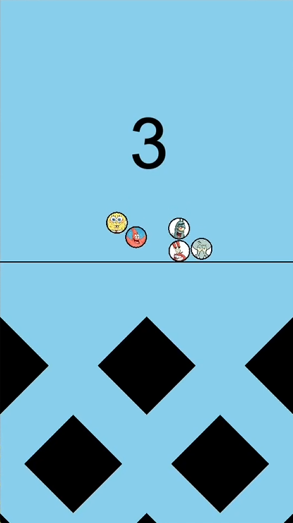
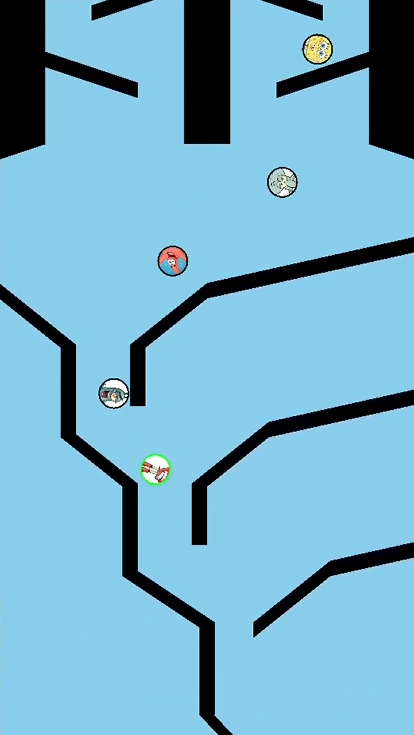
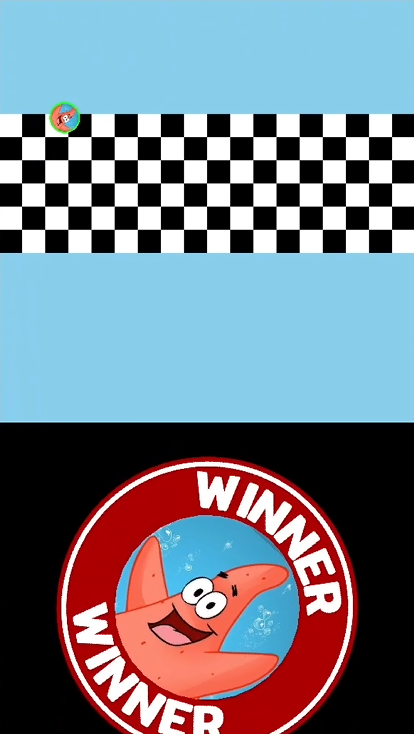

# Brainrot Marble Racer

Characters from the popular show *Spongebob Squarepants* race against each other to the finiish line, but are hindered by immovable obstacles. Who will be the first to reach the finis line?

## Features  
- Play as popular *Spongebob Squarepants* characters.
- Dynamic race environment with obstacles that each character must navigate.
- Exciting race mechanics to simulate a true race-to-the-finish atmosphere.

## How to install
- Clone this repository.
- Install SFML and set up your folder. Move all files here.

## How to execute
- Use the command `make` to create the executable `main.exe`
- Run the executable with `./main`

## Customize race map
All the map information is stored within `map.txt`. Between each newline, you should write the *x* and *y* values of each vertice in a polygon. Comments can be added with \# for reference.

## Screengrabs

